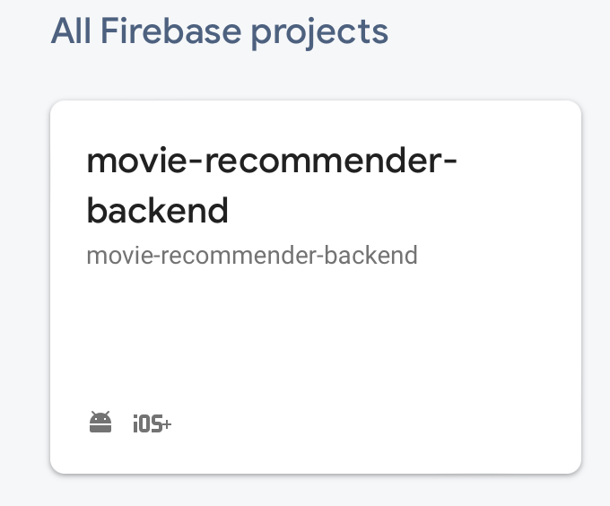
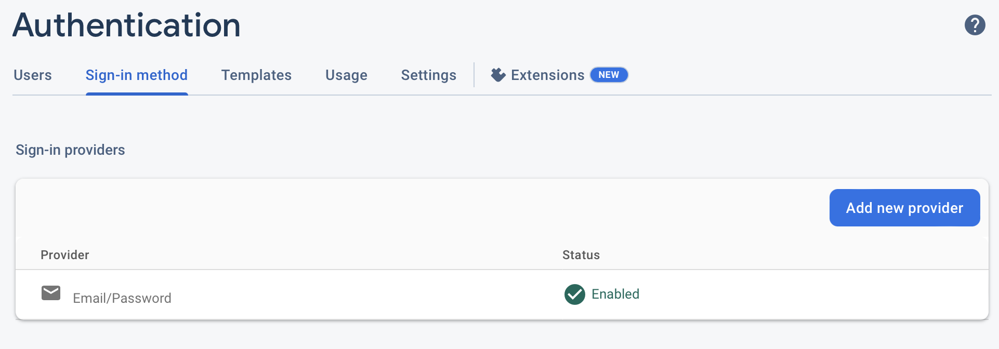
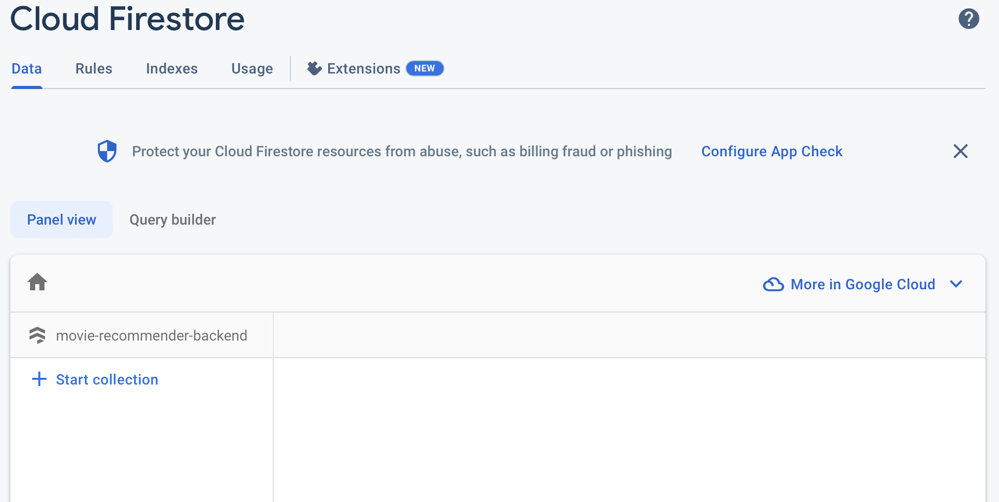

# Movie Recommender

This is a demo application that shows how to start and use firebase for flutter

## Idea

There is a team / group / friends whom you are close with. You normally watch and discuss some interesting movies to watch and recommend others to watch the movie. Now that you share the movie in chats, they get missed somewhere and you need to ask them again or search for that message (if you have patience). So, how about making it easy for you to just go to an app to view what movie your friend recommended.

## Screenshots

<table>
  <tr>
    <td></td>
    <td></td>
    <td></td>
  </tr>
  <tr>
    <td></td>
    <td></td>
    <td></td>
  </tr>
</table>

## Setup the Project

Make sure you have flutter installed before moving to the next step. Or, [install flutter](https://docs.flutter.dev/get-started/install) then move further.

**1. Clone this project:**

```sh
git clone https://github.com/immadisairaj/movie_recommender
```

**2. Go to the project location:**

```sh
cd movie_recommender
```

**3. Setup Firebase CLI:**

Use [this](https://firebase.google.com/docs/cli) link. Or just use the auto install script:

```sh
curl -sL https://firebase.tools | bash
```

**4. Setup firebase for flutter:**

Use [this](https://firebase.google.com/docs/flutter/setup?platform=android) link. Or follow below:

Login to firebase:

```sh
firebase login
```

Activate flutterfire CLI:

```sh
dart pub global activate flutterfire_cli
```

**5. Configure flutter project:**

```sh
flutterfire configure
```

- select `<create a new project>` option
- enter `movie-recommender-backend`
- press enter when you see list of platforms (only android and ios should be selected)
- press enter again when asked to update gradle files

This will create a new poject in your firebase and configure the flutter application for firebase by generating some files.

You can check your firebase console [here](https://console.firebase.google.com/).

You will see a new firebase project in your console.


**5. Setup Auth for the project**

- Click and enter the project.
- Under `Product categories > Build` click on `Authentication`
- Click `Get Started`
- Click on `Email/Password`
- Enable it and hit `Save`



It is optional for you to add additional providers.

**6. Setup Firestore**

- Under `Product categories > Build` click on `Firestore Database`
- Click `Create database`
- Select `Start in test mode` and hit `Next`.
- Select your preferred location and click `Enable`



You can change the rules for firestore later.

**7. Run the project**

Now that all the prerequisites are done, we can run the flutter project.

```sh
flutter run
```

You can just register, use the application, work more on it, share it with your friends.

> Happy Fluttering + Firebasing
